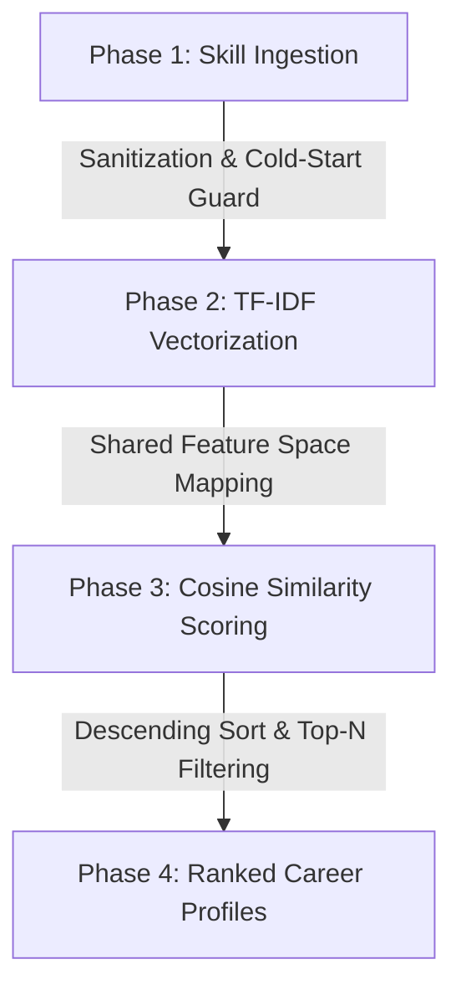

# Task-3-Vennelakanchanapalli
# DecodeLabs — Tech Stack Recommender (Project 3)

An intelligent content-based information retrieval and recommendation engine that maps developer skill sets to industry job profiles. By converting raw text tokens into statistical weights, this project provides data-driven career alignment profiling without hardcoded conditions or nested logic rules.

---

## 🚀 Key Pipeline Features

* **Text Vectorization Pipeline:** Leverages a `TfidfVectorizer` to break down and translate text-based skill arrays into spatial coordinate matrices.
* **Cold-Start Safeguards:** Incorporates an automated injection buffer to preserve data density when a user provides fewer than three entry keywords.
* **Magnitude-Invariant Scoring:** Utilizes spatial **Cosine Similarity** formulas to calculate matching profiles based purely on directional angle alignments, neutralizing biases from text length variations.
* **Multivariate Graphics Suite:** Generates a unified triple-panel analytics dashboard mapping global similarity curves, competitive podium placement tracking, and fine-grained text component weights.

---

## 🛠️ The Core Recommendation Architecture

The engine processes text data using a systematic four-step linear pipeline:



1. **Ingestion & Guarding:** Captures comma-separated input strings, normalizes formatting using hyphen-joins, and verifies data threshold limits.
2. **TF-IDF Vectorization:** Constructs a comprehensive mathematical vocabulary corpus. It rewards rare, defining skills and dynamically penalizes generic language patterns.
3. **Cosine Similarity Scoring:** Measures the exact angular distance between the vector of the user's skills ($A$) and each job profile vector ($B$) using the dot product formula normalized by magnitude:

$$\text{Similarity}(A, B) = \frac{A \cdot B}{\|A\| \|B\|}$$

4. **Filtering Engine:** Sorts profiles in descending sequence and applies a $Top-3$ selection constraint to prevent choice overload.

---

## 📊 Analytics Dashboard Panel

* **Panel 1: Global Score Metric:** A horizontal bar index tracking similarity performance across all 12 operational domains, complete with a visual threshold cutoff boundary.
* **Panel 2: Podiums Rankings:** A clean profile layout presenting percentage-scale values for top career choices alongside competitive trophy designations.
* **Panel 3: Term Weight Heatmap:** A structural breakdown that analyzes structural matrix connections between the top five job categories and the individual weights of your key skill terms.

---

## 💻 Technical Stack

* **Language Platform:** Python 3.x
* **Mathematical Vectorization:** `scikit-learn` (Inference Modules)
* **Data Processing Foundations:** `numpy`
* **Plot Generation Suite:** `matplotlib`, `seaborn`

---

## 📁 Repository Portfolio Roadmap

```text

├── tech_recommender.py        # Project 3: This NLP/TF-IDF Recommendation Engine

└── README.md                  # Complete portfolio documentation

```

---

## ⚙️ Project Installation & Execution

### 1. Build Environment Dependecies

Verify your development workspace has the proper processing components installed:

```bash
pip install numpy matplotlib seaborn scikit-learn

```

### 2. Initiate the Recommendation Engine

Run the program script using your command-line environment:

```bash
python tech_recommender.py

```

---

## 💻 Execution Output Log Sample

```text
============================================================
   Tech Stack Recommender
   The Digital Matchmaker Engine
============================================================

[KNOWLEDGE BASE LOADED]
  Total Job Roles : 12
  Algorithm       : TF-IDF Vectorization + Cosine Similarity
  Pipeline        : Ingest → Score → Sort → Filter (Top-3)

============================================================
   STEP 1: INGESTION — Capture User State
============================================================

  Enter at least 3 skills (comma-separated).
  Example: python, machine learning, sql, docker

  Your Skills: python, pytorch, tensorflow, deep learning

  [USER PROFILE BUILT]
  Raw Skills     : ['python', 'pytorch', 'tensorflow', 'deep-learning']
  Profile Vector : 'python pytorch tensorflow deep-learning'

============================================================
   STEP 2: SCORING — TF-IDF + Cosine Similarity
============================================================

  [TF-IDF APPLIED]
  Vocabulary Size : 58 unique terms
  Vector Shape    : (12, 58)

  [COSINE SCORES COMPUTED]
  Data Scientist                 0.4178  ████████████
  Machine Learning Engineer      0.4612  █████████████
  AI Research Scientist          0.6124  ██████████████████
  ...

============================================================
   STEP 3 & 4: OUTPUT — Top-N Recommendations
============================================================

  Your Skills   : python, pytorch, tensorflow, deep-learning

  TOP 3 CAREER PATH MATCHES:
  ----------------------------------------

  🥇  Rank 1: AI Research Scientist
      Match Score : 0.6124 (61.2%)
      Alignment   : [████████████████████             ]
      Skills Req  : python pytorch tensorflow deep-learning nlp...

  🥈  Rank 2: Machine Learning Engineer
      Match Score : 0.4612 (46.1%)
      Alignment   : [█████████████                    ]
      Skills Req  : python tensorflow pytorch machine-learning...

  🥉  Rank 3: Data Scientist
      Match Score : 0.4178 (41.8%)
      Alignment   : [████████████                     ]
      Skills Req  : python machine-learning statistics pandas...

============================================================
[VISUALIZATION SAVED] viz_p3_recommender.png

```

---

## 🤝 Contributing

Contributions to scale the vocabulary dictionary, integrate API endpoint wrappers, or build interactive front-end web layers (such as Streamlit or Gradio) are welcome.

1. Fork the Project
2. Create your Feature Branch (`git checkout -b feature/Optimization`)
3. Commit your Changes (`git commit -m 'Optimized vector pipeline layout'`)
4. Push to the Branch (`git push origin feature/Optimization`)
5. Open a Pull Request

---

## 👤 Contact

**Vennela Kanchanapalli** * **Organization:** DecodeLabs

* **LinkedIn:** https://www.linkedin.com/in/vennelakanchanapalli
* **GitHub Repository:** https://github.com/vennela0811/Task-3-Vennelakanchanapalli

---

## 📄 License

Distributed under the MIT License. See the snippet below for terms:

```text
MIT License

Copyright (c) 2026 Vennela Kanchanapalli

Permission is hereby granted, free of charge, to any person obtaining a copy
of this software and associated documentation files (the "Software"), to deal
in the Software without restriction, including without limitation the rights
to use, copy, modify, merge, publish, distribute, sublicense, and/or sell
copies of the Software, and to permit persons to whom the Software is
furnished to do so, subject to the following conditions:

The above copyright notice and this permission notice shall be included in all
copies or substantial portions of the Software.

```
